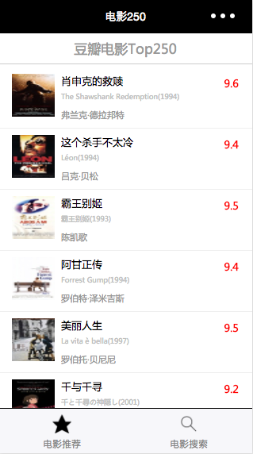
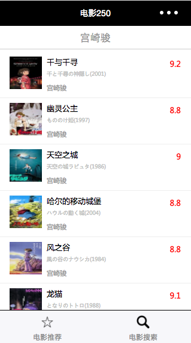
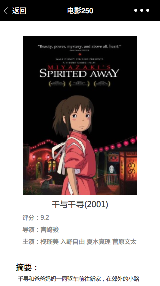

## 1. 项目简介
**项目描述:**

1. 微信小程序项目

**功能模块：**

1. 展示豆瓣电影评分前250名电影列表，点击可进入查
	看影片信息；
2. 提供电影搜索功能，输入关键字可搜索到相关影片信息
	返回列表展示。

**技术要点：**

1. 类似于angular或ionic的MVC设计模式，app.axss中配置入口、导航和窗口样式等；
2. 使用到了小程序ajax技术，并显示加载等待样式；
3. 使用navigator导航到子页面，使用url拼接传值id到电影详情页面，子页面获取值后拼接成API获取数据。

## 2. 效果图
### 启动图 

### 首页

### 分类
